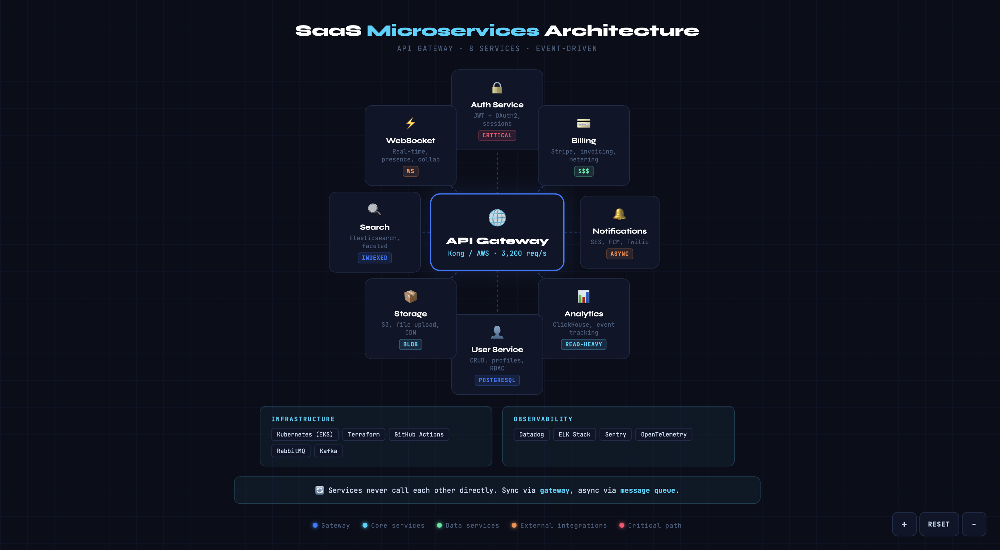

# Diagram Creator — Claude Code Skill

[](https://opensource.org/licenses/MIT)
[](VERSIONS.md)
[](#8-topology-layouts)
[](#5-themes)

Turn any input into beautiful, production-ready diagrams on an infinite canvas. Self-contained HTML files with 5 themes, 8 topology layouts, pan & zoom navigation, professional typography, smooth animations, and zero dependencies.

<p align="center">
  
</p>

## What It Does

Give it **literally any file** — or just a sentence — and it generates a polished diagram as a single `.html` file you can open directly in your browser. No accounts, no setup, no dependencies.

```
"Create a diagram of OAuth 2.0 flow"          → diagram-oauth2-flow.html
"Visualize this docker-compose.yml"            → diagram-docker-compose.html
"Diagram my Kubernetes networking"             → diagram-k8s-networking.html
"Turn this business plan into a visual schema" → diagram-business-plan.html
```

The skill reads any file, auto-detects the format, extracts the relevant structure, and picks the best topology and layout. You don't need to reformat your input — just point it at a file and it figures out the rest.

## Supported Inputs

Give it **any file or topic** — code, config, data, docs, PDFs, spreadsheets, notebooks, API specs, database schemas, CI/CD pipelines, or just a sentence describing what you want. The skill reads the content, auto-detects the format, extracts the relevant structure, and diagrams it. No reformatting needed.

## 8 Topology Layouts

| Layout | Best for | Examples |
|---|---|---|
| **Nested** | Hierarchical containment | Docker networking, K8s pods, VPCs, OSI model |
| **Left-to-right** | Sequential flows | OAuth flow, CI/CD pipeline, user journey |
| **Hub-and-spoke** | Central node + surrounding nodes | API gateway, microservices, load balancer |
| **Timeline** | Ordered vertical steps | Deploy pipeline, project roadmap, historical events |
| **Grid / Matrix** | Comparison tables, feature grids | Feature comparison, skill map, competitive landscape |
| **Tree / Org Chart** | Hierarchical branching | Org chart, file tree, decision tree, taxonomy |
| **Funnel** | Progressive narrowing | Sales funnel, conversion pipeline, data filtering |
| **Comparison / VS** | Side-by-side 2-3 options | Product vs product, tech choices, before/after |

## 5 Themes

| Theme | Best for |
|---|---|
| **Dark** (default) | Technical diagrams, dev docs, README screenshots |
| **Light** | Presentations, documentation sites, print-friendly |
| **Corporate** | Business plans, pitch decks, stakeholder presentations |
| **Neon** | Creative projects, gaming, social media screenshots |
| **Minimal** | Clean documentation, technical specs |

## Output Features

- **Infinite canvas** — pan (click+drag) and zoom (scroll wheel) like Miro/draw.io
- Professional typography (Syne + JetBrains Mono)
- Animated connections and entrance effects
- Fully responsive (works down to 360px)
- Single HTML file, zero external dependencies
- Color-coded layers with auto-generated legends
- Hover effects on all interactive elements
- Keyboard shortcuts: `+` zoom in, `-` zoom out, `0` reset

## Installation

### Option 1: CLI Install (Recommended)

```bash
npx skills add ferdinandobons/diagram-creator-skill
```

### Option 2: Claude Code Plugin

From inside a Claude Code session:

```
/plugin marketplace add ferdinandobons/diagram-creator-skill
/plugin install diagram-creator
```

### Option 3: Clone and Copy

```bash
git clone https://github.com/ferdinandobons/diagram-creator-skill.git
cp -r diagram-creator-skill/skills/diagram-creator ~/.claude/skills/
```

### Option 4: Git Submodule

```bash
git submodule add https://github.com/ferdinandobons/diagram-creator-skill.git .claude/diagram-creator
```

### Option 5: SkillKit (Multi-Agent)

```bash
npx skillkit install ferdinandobons/diagram-creator-skill
```

## Usage

Once installed, just ask Claude naturally:

```
"Create a diagram of my microservices architecture"
"Visualize this docker-compose.yml"
"Turn this business plan into a schema"
"Diagram the OAuth 2.0 flow"
"Make a timeline of the deployment pipeline"
"Show me an org chart from this team spreadsheet"
"Create a sales funnel from this data"
```

Or pass a file directly:

```
"Diagram this file: /path/to/architecture.md"
"Visualize /path/to/docker-compose.yml"
"Turn /path/to/schema.prisma into a diagram"
```

## Skill Structure

```
diagram-creator-skill/
├── .claude-plugin/
│   └── plugin.json              # Marketplace manifest
├── .github/
│   ├── FUNDING.yml
│   ├── ISSUE_TEMPLATE/          # Bug reports, topology requests
│   ├── PULL_REQUEST_TEMPLATE/   # New topology, skill update, docs
│   └── workflows/
│       └── validate-skill.yml   # CI: validates skill structure
├── assets/
│   └── demo.png                 # Hero image
├── skills/
│   └── diagram-creator/
│       ├── SKILL.md             # Core skill instructions
│       ├── references/
│       │   ├── typography-and-colors.md   # Fonts, palette, background
│       │   ├── themes.md                  # 5 color themes
│       │   ├── topology-layouts.md        # Layout rules for all 8 topologies
│       │   ├── components.md              # Cards, badges, callouts, animations
│       │   ├── canvas.md                  # Infinite canvas with pan & zoom
│       │   └── safety-rules.md            # Mandatory layout constraints
│       └── examples/
│           ├── oauth2-flow.md             # Left-to-right example
│           ├── kubernetes-networking.md   # Nested example
│           └── saas-microservices.md      # Hub-and-spoke example
├── AGENTS.md                    # Guidelines for AI agents
├── CLAUDE.md                    # Claude Code project config
├── CONTRIBUTING.md              # How to contribute
├── LICENSE                      # MIT
├── README.md
└── VERSIONS.md                  # Version tracking & changelog
```

## Contributing

Built by [Ferdinando Bonsegna](https://github.com/ferdinandobons).

**Contributions welcome!** Found a way to improve the skill or want to add a new topology? Check out the [Contributing Guide](CONTRIBUTING.md) or [open a PR](https://github.com/ferdinandobons/diagram-creator-skill/pulls).

1. Fork this repository
2. Create a feature branch (`git checkout -b feature/new-topology`)
3. Make your changes
4. Submit a Pull Request using the [appropriate template](.github/PULL_REQUEST_TEMPLATE/)

### Adding a new topology

1. Add layout rules in `references/topology-layouts.md`
2. Add an example in `examples/`
3. Update the topology table in `SKILL.md`
4. Test with at least 3 different inputs

See [CONTRIBUTING.md](CONTRIBUTING.md) for full details.

## License

[MIT](LICENSE)
